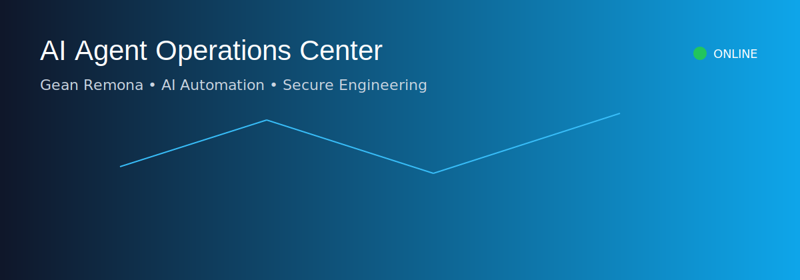
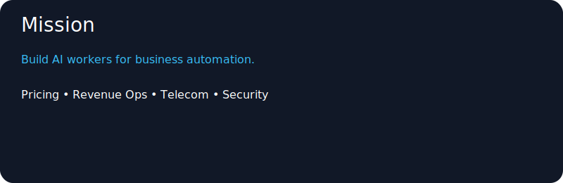
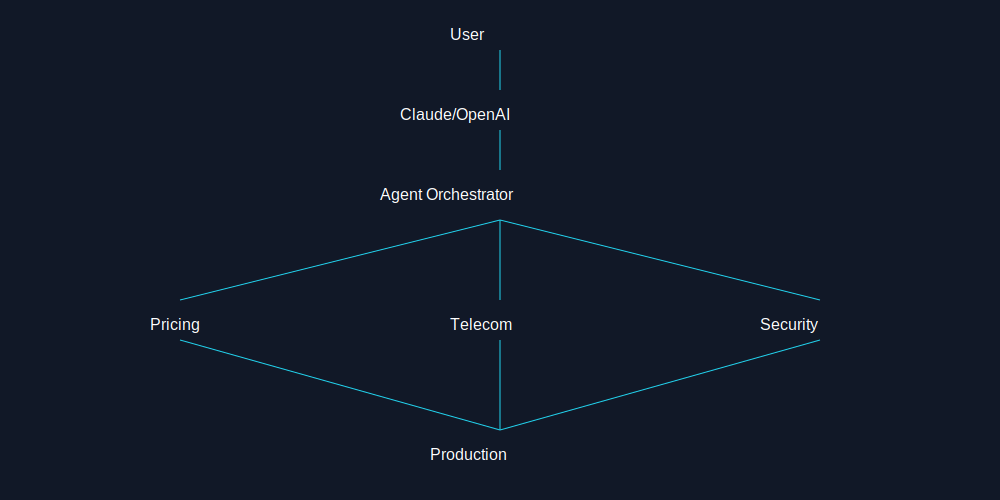
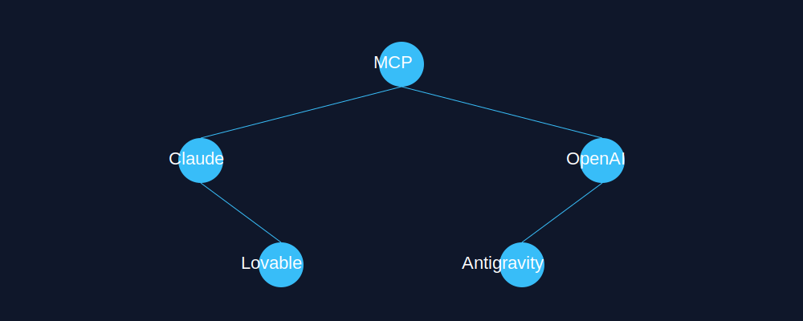
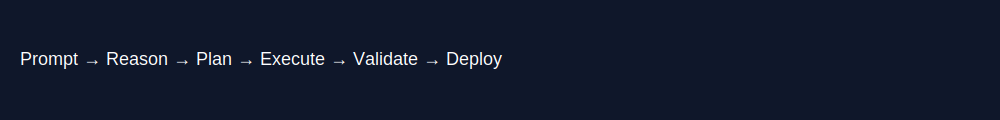

<div align="center">



<!-- Animated typing header -->
<a href="https://git.io/typing-svg">
  
</a>

<br/>

<!-- Social badges -->
<p>
  <a href="https://linkedin.com/in/geanremona" target="_blank">
    
  </a>
  &nbsp;
  
  &nbsp;
  
</p>

</div>

---



---

## ⚡ About Me

```python
class GeanRemona:
    role        = "AI Agent Engineer & Full-Stack Developer"
    location    = "Paris, France 🇫🇷"
    focus       = ["Agentic AI Systems", "LLM Orchestration", "Autonomous Pipelines"]
    tech_stack  = {
        "AI/ML":     ["LangGraph", "LangChain", "Anthropic Claude", "Groq LLM", "ChromaDB"],
        "Backend":   ["FastAPI", "Python", "Node.js", "SQLite", "Neo4j", "Supabase"],
        "Frontend":  ["React", "Vite", "Next.js", "TailwindCSS", "Glassmorphism UI"],
        "DevOps":    ["Docker", "Nginx", "Systemd", "Vultr", "GitHub Actions"],
        "Security":  ["OWASP", "PCI DSS", "CISA", "MCP Security", "JWT / OAuth"],
        "Platforms": ["Meta Graph API", "Stripe", "HeyGen", "Buffer", "Instagram API"],
    }
    currently   = "Building production-grade AI agents that reason, plan, and act autonomously"
```

---



---

## 🚀 Featured Projects

<table>
<tr>
<td width="50%" valign="top">

### 🧠 Nexus Network Ops Agent
**Enterprise Telecom AI — Hackathon MVP**

A production-grade NOC agent powered by the **TSLAM-4B architecture**. Ingests live telemetry, maintenance logs & vendor SLAs — then dispatches crews via Google OR-Tools route optimization.

**Stack:** `LangGraph` `Groq LLM` `ChromaDB RAG` `Neo4j` `FastAPI` `React` `Vite`

🔹 Multi-hop agentic reasoning graph  
🔹 Semantic incident search via RAG  
🔹 RLHF self-learning from operator feedback  
🔹 Real-time SSE streaming to dashboard  
🔹 OR-Tools TSP crew dispatch optimizer  

[](https://python.org)
[]()
[]()

</td>
<td width="50%" valign="top">

### 💰 Revenue Management Agent
**Autonomous Pricing Intelligence — RAISE Summit Paris**

Agentic pipeline that ingests bookings, competitor rates & event calendars to detect demand anomalies and push optimized pricing across OTAs, GDS and direct channels.

**Stack:** `Python` `FastAPI` `Docker` `Kubernetes` `Anthropic Claude`

🔹 Perceive → Analyze → Plan → Act loop  
🔹 RLHF human-in-the-loop reinforcement  
🔹 Dynamic guardrail pricing engine  
🔹 Multi-channel rate publisher (simulated API)  
🔹 Cited Markdown revenue strategy brief  

[]()
[]()
[]()

</td>
</tr>
<tr>
<td width="50%" valign="top">

### 📱 Instagram Automation Engine
**ManyChat-Style DM Automation System**

Production-ready automation backend leveraging the Meta Graph API & Messenger Platform. Detects comments/followers in real-time, triggers keyword-based DM responses, and respects Meta's 24-hour messaging window.

**Stack:** `FastAPI` `SQLite` `React` `Vite` `Meta Graph API`

🔹 Webhook handler for real-time events  
🔹 SQLite-backed rules & template engine  
🔹 Rate-limited DM dispatch (200/hr)  
🔹 Follower polling & greeting automation  
🔹 Glassmorphism analytics dashboard  

[]()
[]()

</td>
<td width="50%" valign="top">

### 🎬 Social Media Agentic Pipeline
**Claude → HeyGen → Buffer → ManyChat**

End-to-end content automation: drop a topic, get a scripted, AI-voiced avatar video auto-scheduled across LinkedIn, X, Instagram & YouTube — with cost tracking per render.

**Stack:** `LangGraph` `Anthropic Claude` `FastAPI` `React` `APScheduler`

🔹 LangGraph stateful multi-step workflow  
🔹 HeyGen avatar video generation  
🔹 Multi-platform distribution (4 channels)  
🔹 SQLite persistent state management  
🔹 Human-in-the-loop approval dashboard  

[]()
[]()

</td>
</tr>
<tr>
<td width="50%" valign="top">

### 🍽️ Tasty QR — AI Menu SaaS
**Restaurant QR Menu with LLM Chatbot**

Full-stack QR menu SaaS with allergen-safe multilingual chatbot, Stripe payments, Supabase backend, and a privacy-preserving analytics dashboard. OWASP & PCI DSS compliant.

**Stack:** `Next.js` `Supabase` `Stripe` `Prisma` `Node.js`

🔹 LLM-driven menu chatbot with prompt-injection prevention  
🔹 Stripe checkout & subscription billing  
🔹 CSP-hardened OWASP/PCI DSS security  
🔹 Multilingual allergen-safe responses  
🔹 Privacy-preserving analytics  

[]()
[]()
[]()

</td>
<td width="50%" valign="top">

### 🔐 Security & Compliance Audits
**OWASP · PCI DSS · CISA · ANSSI**

End-to-end security hardening across multiple production codebases: Git secret remediation, supply-chain integrity via pinned GitHub Action SHAs, CSP enforcement, and LLM prompt injection prevention.

**Stack:** `GitHub Actions` `Wazuh` `Splunk` `Qualys` `MCP Security`

🔹 CISA & PCI DSS compliance remediation  
🔹 Stripe session leak investigation  
🔹 Supabase service_role key rotation  
🔹 Pinned SHA GitHub CI/CD hardening  
🔹 SIEM log analysis (Splunk / Wazuh)  

[]()
[]()
[]()

</td>
</tr>
</table>

---



---

## 🛠️ Tech Stack & Tools

<div align="center">

### 🤖 AI / Agentic


### 🐍 Backend


### 🎨 Frontend


### ☁️ DevOps & Cloud


### 🔐 Security


</div>

---

## 📊 GitHub Stats

<div align="center">


&nbsp;


<br/>


<br/>


</div>

---



---

## 🏆 Achievements & Highlights

<div align="center">

| 🎯 Achievement | 📌 Details |
|:---|:---|
| 🥇 **RAISE Summit Hackathon — Paris** | Revenue Agent — Autonomous pricing intelligence system |
| 🤖 **5+ Agentic AI Systems** | Production-grade agents with LangGraph multi-step workflows |
| 🔐 **PCI DSS / OWASP Certified Security** | Full compliance audits across production SaaS codebases |
| 📡 **Telecom NOC Agent — TSLAM-4B** | Enterprise AI with Neo4j, ChromaDB, OR-Tools optimization |
| 📱 **Meta Graph API Integration** | ManyChat-style Instagram automation at 200 DM/hr scale |
| 🎬 **Multi-Platform Content Pipeline** | Fully automated Claude → HeyGen → Buffer → ManyChat flow |
| ☁️ **Cloud Deployments on Vultr** | Systemd + Docker + Nginx production deployments |

</div>

---

<div align="center">


<br/>

**"Building AI agents that don't just answer questions — they reason, plan, and act."**

<br/>

<a href="https://linkedin.com/in/geanremona">
  
</a>

<br/><br/>


</div>
